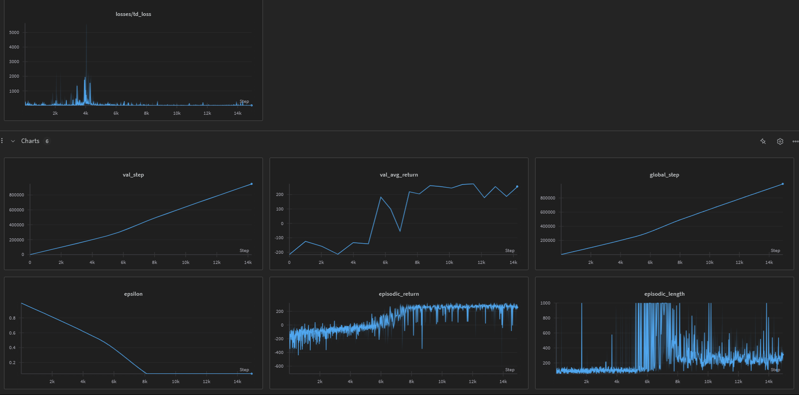

# Deep Q-Network (DQN) for Lunar Lander

This repository contains an implementation of a Deep Q-Network (DQN) agent that learns to play the Lunar Lander environment from OpenAI Gymnasium.



## Overview

This project implements a DQN agent that learns to successfully land a lunar module on the moon's surface. The agent is trained using a reinforcement learning approach where it learns to map states to actions in order to maximize cumulative rewards.

### The Lunar Lander Environment

In the LunarLander-v3 environment:
- The goal is to land the lunar module safely between two flags
- The agent controls the thrusters (main engine and side engines) to navigate the lander
- The state space consists of 8 continuous variables representing position, velocity, angle, and leg contact
- The action space consists of 4 discrete actions (fire left engine, fire main engine, fire right engine, do nothing)
- The episode ends when the lander crashes, flies off-screen, or lands successfully

## Features

- **Deep Q-Network (DQN)** implementation with experience replay and target network
- **Epsilon-greedy exploration** with linear decay
- **TensorBoard** integration for tracking training metrics
- **Weights & Biases (WandB)** integration for experiment tracking
- **Video recording** of agent performance during and after training
- Evaluation mode for testing the trained agent

## Architecture

The DQN uses a simple yet effective neural network architecture:
- Input layer: State dimension (8 for Lunar Lander)
- Hidden layer 1: 256 neurons with ReLU activation
- Hidden layer 2: 512 neurons with ReLU activation 
- Output layer: Action dimension (4 for Lunar Lander)


### Configuration

The training parameters can be modified in the `Config` class within the `train.py` file:

```python
class Config:
    # Experiment settings
    exp_name = "DQN-CartPole"
    seed = 42
    env_id = "LunarLander-v3"
    
    # Training parameters
    total_timesteps = 1000000
    learning_rate = 2.5e-4
    buffer_size = 20000 
    gamma = 0.99
    tau = 1.0
    target_network_frequency = 50
    batch_size = 128
    start_e = 1.0
    end_e = 0.05
    exploration_fraction = 0.5
    learning_starts = 1000
    train_frequency = 10
    
    # Logging & saving
    capture_video = True
    save_model = True
    upload_model = True
    hf_entity = ""  # Your Hugging Face username
    
    # WandB settings
    use_wandb = True
    wandb_project = "cleanRL"
    wandb_entity = ""  # Your WandB username/team
```

### Hyperparameters

Key hyperparameters include:

- **total_timesteps**: Total number of environment steps to train for
- **learning_rate**: Learning rate for the optimizer
- **buffer_size**: Size of the replay buffer
- **gamma**: Discount factor for future rewards
- **tau**: Soft update coefficient for target network
- **target_network_frequency**: How often to update the target network
- **batch_size**: Batch size for sampling from replay buffer
- **start_e/end_e/exploration_fraction**: Controls the epsilon-greedy exploration schedule

## Results

The DQN agent typically learns to land successfully after about 300-500 episodes of training. Performance metrics tracked during training include:

- Episode returns (rewards)
- Episode lengths
- TD loss
- Epsilon value

## Requirements

- Python 3.7+
- PyTorch
- Gymnasium
- Numpy
- TensorBoard
- Weights & Biases (optional for tracking)
- Stable-Baselines3 (for the replay buffer implementation)
- OpenCV (for video processing)
- Imageio (for creating videos)

## Acknowledgments

This implementation is inspired by various DQN implementations and the CleanRL project's approach to reinforcement learning algorithm implementation.

## License

[MIT License](LICENSE)
