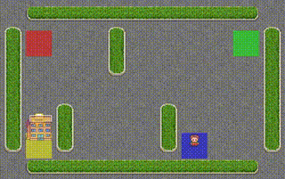

# DQN-Taxi: Deep Q-Network for OpenAI Gym Taxi-v3

This project implements a Deep Q-Network (DQN) agent to solve the classic Taxi-v3 environment from OpenAI Gym. The agent learns to efficiently pick up and drop off passengers in a grid world using reinforcement learning.

[]

## Environment
- **Taxi-v3** is a discrete environment with:
  - **State space:** 16 (or 500 for the full version)
  - **Action space:** 6 (South, North, East, West, Pickup, Dropoff)
- The agent receives positive rewards for successful drop-offs and negative rewards for illegal moves or time steps.

## Features
- DQN with experience replay and target network
- Epsilon-greedy exploration
- One-hot encoding for discrete state representation
- Logging of Q-values, advantage, and value estimates
- Integration with TensorBoard and Weights & Biases (WandB) for experiment tracking

## Logging & Visualization
- Training logs and metrics are saved for visualization in TensorBoard and/or WandB.
- Q-values, advantage, and value estimates are logged for analysis.

## Customization
- Change hyperparameters and logging options in the `Config` class in `train.py`.
- You can switch between different exploration strategies or network architectures as needed.

## Results
The DQN agent should learn to solve the Taxi-v3 environment, achieving high average rewards after sufficient training.

## References
- [OpenAI Gym Taxi-v3](https://www.gymlibrary.dev/environments/toy_text/taxi/)
- [DQN Paper (Mnih et al., 2015)](https://www.nature.com/articles/nature14236)
- [Stable Baselines3](https://stable-baselines3.readthedocs.io/)

## License
MIT License
