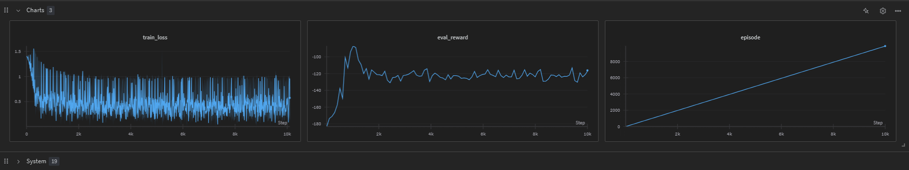

# Behavioral Cloning for GridWorld

This project implements Behavioral Cloning (BC) for learning policies from expert demonstrations in a GridWorld environment. The agent learns to imitate expert behavior by training a neural network to predict actions given states.

## 🎯 Overview

Behavioral Cloning is a supervised learning approach to imitation learning where:
- Expert demonstrations are collected as state-action pairs
- A policy network is trained to minimize the difference between predicted and expert actions
- The learned policy can then be evaluated in the environment

## 📁 Project Structure

```
├── BC.py                    # Main behavioral cloning implementation
├── gridworld.py            # GridWorld environment
├── gridworld.json          # Environment configuration
├── images/
│   └── image.png           # GridWorld visualization
├── imitation-learning-tutorials/
│   ├── expert_data/
│   │   └── ckpt0.pkl       # Expert demonstration data
│   └── ...                 # Additional tutorial notebooks
└── README.md               # This file
```

## 🖼️ GridWorld Visualization



*The GridWorld environment where the agent learns to navigate and imitate expert behavior.*

## 🚀 Quick Start

### Prerequisites

```bash
pip install torch tqdm wandb
```

### Running the Code

```bash
python BC.py
```

This will:
1. Load expert demonstrations from `expert_data/ckpt0.pkl`
2. Train a policy network using behavioral cloning
3. Evaluate the policy every 100 episodes
4. Log training progress to Weights & Biases

## 🧠 Model Architecture

### PolicyNet
- **Input**: One-hot encoded state (2500 dimensions)
- **Hidden Layers**: 
  - FC1: 2500 → 128 (ReLU)
  - FC2: 128 → 64 (ReLU)
- **Output**: 4 action logits (up, down, left, right)

### Training Details
- **Loss Function**: Cross-entropy loss
- **Optimizer**: Adam (lr=2.5e-4)
- **Batch Processing**: Trains on individual expert episodes

## 📊 Monitoring with Weights & Biases

The code automatically logs:
- **train_loss**: Cross-entropy loss for each training episode
- **eval_reward**: Average reward during evaluation
- **episode**: Training episode number
- **hyperparameters**: Learning rate, architecture details

## 🔧 Configuration

Modify the `Config` class in `BC.py`:

```python
@dataclass
class Config:
    lr: float = 2.5e-4                    # Learning rate
    project_name: str = "behavioral-cloning"  # WandB project name
    run_name: str = "bc-gridworld"           # WandB run name
```

## 📈 Key Components

### BC Class
- `__init__()`: Initializes policy network, optimizer, and WandB logging
- `train()`: Trains on expert state-action pairs for one episode
- `evaluate()`: Evaluates policy performance in the environment

### Helper Functions
- `sample_action()`: Samples actions from policy logits (greedy/stochastic)
- `one_hot_encode()`: Converts state integers to one-hot vectors

### Training Loop
```python
curr = 0
for i, length in enumerate(timestep_lens):
    # Extract episode data
    expert_states = all_states[curr: curr + length]
    expert_actions = all_actions[curr: curr + length]
    
    # Train on this episode
    loss = model.train(expert_states, expert_actions)
    
    # Evaluate every 100 episodes
    if i % 100 == 0:
        rew = model.evaluate()
        print(f"Episode {i}, Eval Reward: {rew}")
    
    curr += length
```

## 🎮 Environment Details

- **GridWorld**: 50x50 grid environment
- **States**: 2500 possible positions (50×50)
- **Actions**: 4 discrete actions (up, down, left, right)
- **Evaluation**: Uses batched environments (128 parallel instances)

## 📊 Expert Data Format

The expert data (`ckpt0.pkl`) contains:
- `states`: Flattened array of all expert states
- `actions`: Flattened array of all expert actions  
- `timestep_lens`: Length of each expert episode

## 🔍 Evaluation Metrics

- **Average Reward**: Mean reward per episode across evaluation runs
- **Training Loss**: Cross-entropy loss between predicted and expert actions


**Note**: Make sure to have expert demonstrations and proper environment setup before running the code.

**Special Thanks**: This implementation is inspired by the Imitation Learning tutorials available at [Imitation Learning Tutorials](https://github.com/tsmatz/imitation-learning-tutorials/blob/master)