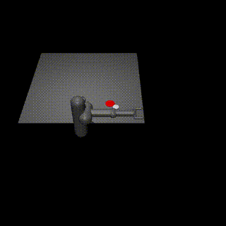
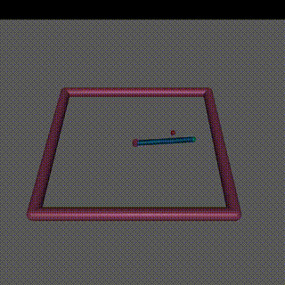
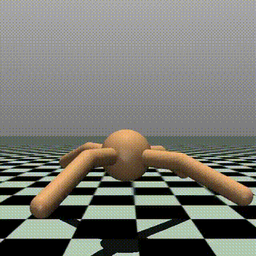

# PPO on MuJoCo Environments

This directory contains PPO implementations specifically for MuJoCo continuous control environments. These environments represent some of the most challenging continuous control tasks in reinforcement learning, requiring sophisticated policy learning to coordinate multiple joints and maintain dynamic stability.

## Overview

MuJoCo (Multi-Joint dynamics with Contact) is a physics engine designed for robotics and biomechanics simulation. The environments implemented here focus on locomotion tasks that require:

- Complex multi-joint coordination
- Dynamic stability and balance
- Continuous action spaces with high dimensionality
- Robust policy learning for physical simulation

## Environments

PPO has been successfully applied to several challenging MuJoCo continuous control environments:

| Environment | Description | Action Space | Observation Space | Demo | WandB Report |
|-------------|-------------|--------------|-------------------|------|--------------|
| **HalfCheetah-v5** | Quadrupedal locomotion task where the agent learns to run forward using a cheetah-like body. Requires coordination of hip, knee, and ankle joints for fast and stable running. | 6D continuous (hip, knee, ankle torques) | 17D continuous (joint positions, velocities, and orientations) |  | [PPO on HalfCheetah-v5](https://wandb.ai/rentio/cleanRL/reports/PPO-C-on-Half-Cheetah--VmlldzoxMzUxNjA5Mg?accessToken=r6rxlnqyjc1lpoq1gx4w2ybt01jsrta2y8p8ycwmcnisgm60hhabbvywl3aepbpa) |
| **Humanoid-v5** | Complex humanoid control task with full body coordination. The agent learns to maintain balance and locomotion using a humanoid robot with multiple joints and degrees of freedom. Requires sophisticated control of torso, arms, and legs. | High-dimensional continuous (full body joint torques) | High-dimensional continuous (joint positions, velocities, body orientation, and contact information) |  | [PPO on Humanoid-v5](https://wandb.ai/rentio/cleanRL/reports/PPO-Humanoid--VmlldzoxMzUzMzMwNA) |
| **Hopper-v5** | Single-leg hopping locomotion task where the agent learns to hop forward while maintaining balance. Requires precise control of thigh, leg, and foot joints to achieve stable hopping motion without falling. | 3D continuous (thigh, leg, foot torques) | 11D continuous (joint positions, velocities, and body orientation) |  | [PPO on Hopper-v5](https://wandb.ai/rentio/cleanRL/reports/PPO-Hopper---VmlldzoxMzU1NDA0MQ?accessToken=oo2o366arrkrc26st173cov4n701398wca186wzx6dpxy47gadpl9zwkocbvry0r) |
| **Walker2d-v5** | Bipedal walking locomotion task where the agent learns to walk forward using two legs. Requires coordination of thigh, leg, and foot joints for both legs to achieve stable walking motion while maintaining upright posture. | 6D continuous (left/right thigh, leg, foot torques) | 17D continuous (joint positions, velocities, and body orientation) |  | [PPO on Walker2d-v5](https://api.wandb.ai/links/rentio/sn4gsbac) |
| **Pusher-v4** | Robotic arm manipulation task where the agent learns to control a 7-DOF arm to push objects to target locations. Requires precise control of multiple joints to position and manipulate objects in 3D space while avoiding obstacles. | 7D continuous (arm joint torques) | 23D continuous (joint angles, velocities, object positions, target location) |  | [PPO on Pusher-v4](https://wandb.ai/rentio/cleanRL/reports/PPO-Reacher--VmlldzoxMzU1NDA2NA?accessToken=bw14z6xzu5603mvjvha1eoqbzasq3iom5rkzg9q0kr82s57hysdx96m9fm74nz8i) |
| **Reacher-v4** | Robotic arm reaching task where the agent learns to control a 2-joint arm to reach target positions. Requires precise control of shoulder and elbow joints to position the end effector at randomly placed targets in 2D space. | 2D continuous (shoulder, elbow torques) | 11D continuous (joint angles, velocities, target position, fingertip position) |  | [PPO on Reacher-v4](https://wandb.ai/rentio/cleanRL/reports/REACHER-V4-PPO--VmlldzoxMzU1NDA5NA?accessToken=jey5gs4ocoyq47foysww4ss9irq9y6s8pnpqamfre6xevadkzk20rvd8afmn04o0) |
| **Ant-v4** | Quadrupedal locomotion task where the agent learns to control a four-legged ant robot to move forward. Requires coordination of 8 joints (2 per leg) to achieve stable walking while maintaining balance and avoiding falls. | 8D continuous (hip and ankle torques for 4 legs) | 27D continuous (joint positions, velocities, and body orientation) |  | [PPO on Ant-v4](https://wandb.ai/rentio/cleanRL/reports/PPO-Ant--VmlldzoxMzU1NDA2NA) |
| **Swimmer-v4** | Aquatic locomotion task where the agent learns to control a swimming robot to move forward through water. Requires coordination of multiple joints to generate propulsive forces and maintain directional movement in fluid environment. | 2D continuous (joint torques for swimming motion) | 8D continuous (joint angles, velocities, and body orientation) |  | [PPO on Swimmer-v4](https://wandb.ai/rentio/cleanRL/reports/Swimmer-V4-PPO--VmlldzoxMzU1NDEyMA?accessToken=0k2daj964kvs5xdgugt05dx7ssgxlmhxo8y1n0c4uaa1o9w7yo3x0bq7vrnp7sh4) |

## Key Challenges

### HalfCheetah-v5
- **Locomotion Learning**: Agent must learn efficient running gaits
- **Speed vs Stability**: Balancing forward velocity with stable movement
- **Joint Coordination**: Coordinating 6 actuated joints for smooth locomotion
- **Energy Efficiency**: Learning gaits that maximize speed while minimizing energy

### Humanoid-v5
- **Balance Control**: Maintaining upright posture while moving
- **High-Dimensional Control**: Managing many degrees of freedom simultaneously
- **Dynamic Stability**: Learning to recover from perturbations
- **Complex Reward Structure**: Balancing multiple objectives (forward progress, stability, energy efficiency)

### Hopper-v5
- **Single-Leg Balance**: Maintaining stability on one leg while hopping
- **Hopping Dynamics**: Learning efficient hopping gaits for forward locomotion
- **Fall Prevention**: Avoiding falls while maximizing forward progress
- **Timing Control**: Coordinating joint movements for effective push-off and landing

### Walker2d-v5
- **Bipedal Coordination**: Coordinating two legs for stable walking motion
- **Gait Learning**: Developing efficient walking patterns and step sequences
- **Balance Control**: Maintaining upright posture while walking forward
- **Leg Synchronization**: Timing left and right leg movements for smooth locomotion

### Pusher-v4
- **Object Manipulation**: Learning to push objects to precise target locations
- **Multi-Joint Coordination**: Coordinating 7 arm joints for complex manipulation tasks
- **Spatial Reasoning**: Understanding object-target relationships in 3D space
- **Force Control**: Applying appropriate forces to move objects without losing control

### Reacher-v4
- **Precision Control**: Accurately positioning the end effector at target locations
- **Joint Coordination**: Coordinating shoulder and elbow movements for smooth reaching
- **Target Tracking**: Adapting to randomly placed targets in the workspace
- **Efficiency Learning**: Finding optimal paths to targets while minimizing energy expenditure

### Ant-v4
- **Quadrupedal Coordination**: Coordinating four legs for stable forward locomotion
- **Multi-Joint Control**: Managing 8 actuated joints simultaneously for smooth movement
- **Balance Maintenance**: Preventing falls while maintaining forward progress
- **Gait Development**: Learning efficient walking patterns with four-legged coordination

### Swimmer-v4
- **Aquatic Locomotion**: Learning to generate propulsive forces in fluid environment
- **Undulating Motion**: Coordinating joint movements for wave-like swimming patterns
- **Directional Control**: Maintaining forward movement without drifting off course
- **Efficiency Optimization**: Maximizing swimming speed while minimizing energy expenditure

## Implementation Details

All MuJoCo implementations use:
- **Continuous PPO**: Adapted for continuous action spaces using Gaussian policies
- **Clipped Surrogate Objective**: For stable policy updates
- **Value Function Learning**: Separate critic network for state value estimation

### Hyperparameters
The MuJoCo environments typically require:
- Lower learning rates (1e-4 to 3e-4) for stable learning
- Longer training episodes due to environment complexity
- Careful entropy coefficient tuning for exploration vs exploitation
- Higher GAE lambda values for better value estimation

## Performance Metrics

### HalfCheetah-v5
- **Target Performance**: Consistent forward velocity > 1000 units/episode
- **Training Time**: Typically converges within 2-5M timesteps
- **Key Metrics**: Average velocity, episode length, stability of gait

### Humanoid-v5
- **Target Performance**: Sustained upright locomotion > 5000 units/episode
- **Training Time**: Requires 5-10M timesteps for stable policies
- **Key Metrics**: Episode length, forward progress, fall frequency, energy efficiency

### Hopper-v5
- **Target Performance**: Consistent hopping locomotion > 3000 units/episode
- **Training Time**: Typically converges within 1-3M timesteps
- **Key Metrics**: Hopping distance, episode length, balance stability, hop efficiency

### Walker2d-v5
- **Target Performance**: Stable walking locomotion > 4000 units/episode
- **Training Time**: Typically converges within 2-4M timesteps
- **Key Metrics**: Walking distance, episode length, gait stability, walking speed

### Pusher-v4
- **Target Performance**: Successful object pushing with reward > -50 per episode
- **Training Time**: Typically converges within 2-5M timesteps
- **Key Metrics**: Object-target distance, manipulation success rate, trajectory efficiency, force control

### Reacher-v4
- **Target Performance**: Consistent target reaching with reward > -10 per episode
- **Training Time**: Typically converges within 0.5-2M timesteps
- **Key Metrics**: Target distance accuracy, reaching efficiency, joint smoothness, success rate

### Ant-v4
- **Target Performance**: Stable forward locomotion > 4000 units/episode
- **Training Time**: Typically converges within 3-6M timesteps
- **Key Metrics**: Forward velocity, episode length, balance stability, gait efficiency

### Swimmer-v4
- **Target Performance**: Consistent swimming locomotion > 300 units/episode
- **Training Time**: Typically converges within 1-3M timesteps
- **Key Metrics**: Swimming speed, directional accuracy, stroke efficiency, energy consumption

## Files Description

- `half-cheetah.py`: PPO implementation for HalfCheetah-v5 environment
- `humanoids.py`: PPO implementation for Humanoid-v5 environment
- `ant-v4.py`: PPO implementation for Ant-v4 quadrupedal locomotion
- `hopper.py`: PPO implementation for Hopper hopping locomotion
- `swimmer.py`: PPO implementation for Swimmer aquatic locomotion
- `pusher.py`: PPO implementation for Pusher manipulation task
- `reacher.py`: PPO implementation for Reacher arm reaching task

## Usage

```bash
# Train HalfCheetah
python half-cheetah.py

# Train Humanoid
python humanoids.py

# Train other MuJoCo environments
python ant-v4.py
python hopper.py
# ... etc
```

## Dependencies

- PyTorch
- Gymnasium[mujoco]
- MuJoCo (physics engine)
- NumPy
- WandB (for experiment tracking)
- TensorBoard

## Notes

- MuJoCo environments require the MuJoCo physics engine to be installed
- These environments are computationally intensive and benefit from GPU acceleration
- Training times can be significant (hours to days depending on environment and hardware)
- Hyperparameter tuning is crucial for success in these complex environments

## References

- [MuJoCo Official Documentation](https://mujoco.readthedocs.io/)
- [Gymnasium MuJoCo Environments](https://gymnasium.farama.org/environments/mujoco/)
- [PPO Paper: Proximal Policy Optimization](https://arxiv.org/abs/1707.06347)
