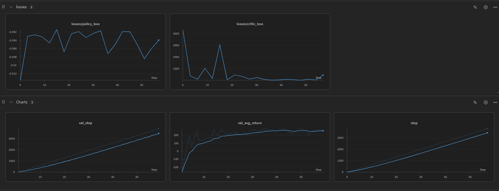
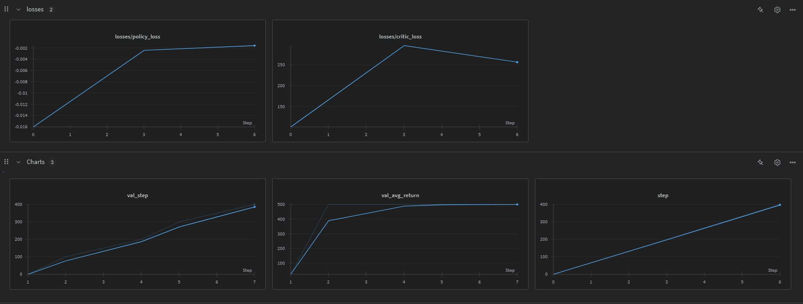

# Proximal Policy Optimization (PPO)

This directory contains implementations of the Proximal Policy Optimization (PPO) algorithm for various environments in PyTorch.

## Overview

PPO is a state-of-the-art policy gradient method that combines the stability of trust region methods with the simplicity and efficiency of first-order optimization. It addresses the issue of choosing the right step size when optimizing policies by introducing a clipped surrogate objective function.

Key features of this implementation:
- Clipped surrogate objective function for stable policy updates
- Actor-Critic architecture with value function for advantage estimation
- Generalized Advantage Estimation (GAE) for reduced variance
- Configurable hyperparameters for different environments
- Two implementations: separate actor-critic networks and unified network

## Implementations

This repository includes two main PPO implementations:

1. **Standard PPO (`train.py`)**: Uses separate networks for the actor (policy) and critic (value function). Applied to the LunarLander environment.


## Environments

This implementation has been tested on:
- **CartPole-v1**: A classic control task where a pole is attached to a cart that moves along a frictionless track.
- **LunarLander-v3**: A more complex environment where an agent must land a lunar module on a landing pad.


## Configuration

The implementation uses a `Config` class that specifies hyperparameters for training:

- `exp_name`: Name of the experiment
- `seed`: Random seed for reproducibility
- `env_id`: ID of the Gymnasium environment
- `episodes`: Number of episodes to train
- `lr` / `learning_rate`: Learning rate for the optimizer
- `gamma`: Discount factor
- `clip_value`: PPO clipping parameter (epsilon)
- `PPO_EPOCHS`: Number of optimization epochs per batch
- `ENTROPY_COEFF`: Coefficient for entropy bonus
- `max_steps`: Maximum number of steps per episode (for `train.py`)

Additional important parameters:
- `VALUE_COEFF`: Coefficient for the value function loss

## Algorithm Details

PPO works by:

1. **Collecting Experience**: The agent interacts with the environment to collect trajectories.
2. **Computing Advantages**: Generalized Advantage Estimation (GAE) is used to estimate the advantage function.
3. **Policy Update**: The policy is updated using the clipped surrogate objective:
   ```
   L = min(r_t(θ) * A_t, clip(r_t(θ), 1-ε, 1+ε) * A_t)
   ```
   where r_t(θ) is the ratio of new to old policy probabilities, A_t is the advantage, and ε is the clip parameter.
4. **Value Function Update**: The value function is updated to better predict returns.

The clipping mechanism prevents too large policy updates, improving stability without the computational overhead of trust region methods like TRPO.

## Architecture

### Standard PPO (train.py)
- **Actor Network**: Maps states to action probabilities
- **Critic Network**: Estimates the value function

### Unified PPO (train_unified.py)
- **Shared Layers**: Extract features from the state
- **Policy Head**: Maps features to action probabilities
- **Value Head**: Maps features to state value estimates

## Logging and Monitoring

Training progress is logged using:
- **TensorBoard**: Local visualization of training metrics
- **Weights & Biases (WandB)**: Cloud-based experiment tracking
- **Video Capture**: Records videos of agent performance at intervals

## Results

### LunarLander

The following image shows the training performance on the LunarLander environment:



### Pendulum

The following image shows the training performance on the Pendulum environment:



## Dependencies

- PyTorch
- Gymnasium
- NumPy
- WandB (optional, for experiment tracking)
- TensorBoard
- OpenCV
- Tqdm

## References


- [CleanRL](https://github.com/vwxyzjn/cleanrl) - Inspiration for code structure and implementation style
