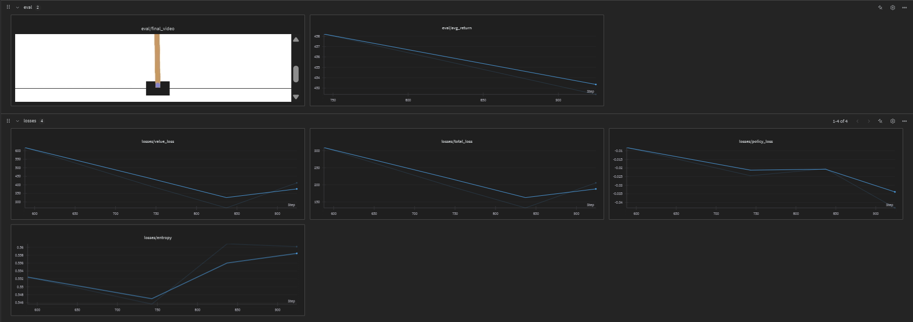
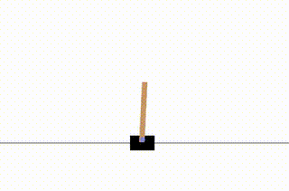

# Random Network Distillation (RND)

This directory contains implementations of Random Network Distillation (RND) combined with Proximal Policy Optimization (PPO) for curiosity-driven exploration in reinforcement learning.

## Overview

Random Network Distillation (RND) is an exploration method that generates intrinsic rewards by measuring the agent's ability to predict the output of a randomly initialized neural network. The key insight is that prediction error correlates with novelty - states that are visited less frequently are harder to predict, leading to higher intrinsic rewards and encouraging exploration.

Key features of this implementation:
- **Intrinsic Motivation**: Uses prediction error as curiosity signal
- **PPO Integration**: Combines RND with PPO for stable policy optimization
- **Dual Advantage Estimation**: Separate advantages for extrinsic and intrinsic rewards
- **Normalization**: Running normalization of intrinsic rewards for stable training
- **Multi-Environment Support**: Works with discrete and continuous control tasks

## How RND Works

RND consists of two neural networks:
1. **Target Network**: A randomly initialized network that remains fixed throughout training
2. **Predictor Network**: A learnable network that tries to predict the target network's output

The prediction error serves as an intrinsic reward:
```
intrinsic_reward = ||predictor(state) - target(state)||²
```

This encourages the agent to visit novel states where the prediction error is high.

## Implementations

This repository includes three main RND implementations:

###  **Classic Control (`train_classic.py`)**
- Environment: CartPole-v1
- Simple implementation for discrete action spaces
- Good starting point for understanding RND

###  **Lunar Lander (`lunar.py`)**
- Environment: LunarLander-v3
- Vectorized training with multiple parallel environments
- More complex continuous state space
- Optimized for performance and stability

## Environments

This implementation has been tested on:
- **CartPole-v1**: Classic control task for balancing a pole on a cart
- **LunarLander-v3**: Spacecraft landing with continuous observations and discrete actions

## Algorithm Details

### RND + PPO Training Loop

1. **Environment Interaction**: Collect trajectories using current policy
2. **Intrinsic Reward Calculation**: 
   - Compute prediction error: `||predictor(state) - target(state)||²`
   - Normalize intrinsic rewards using running statistics
3. **Advantage Estimation**: 
   - Compute extrinsic advantages using environment rewards
   - Compute intrinsic advantages using RND rewards
   - Combine advantages with weighting coefficients
4. **Policy Update**: Update policy using combined advantages via PPO
5. **Predictor Update**: Train predictor network to minimize prediction error

### Key Components

#### Target Network
```python
class TargetNet(nn.Module):
    def __init__(self, state_space):
        super(TargetNet, self).__init__()
        # Randomly initialized, never updated
        self.fc1 = nn.Linear(state_space, 256)
        self.fc2 = nn.Linear(256, 256)
        self.fc3 = nn.Linear(256, 256)
```

#### Predictor Network
```python
class PredictorNet(nn.Module):
    def __init__(self, state_space):
        super(PredictorNet, self).__init__()
        # Learnable network
        self.fc1 = nn.Linear(state_space, 256)
        self.fc2 = nn.Linear(256, 256)
        self.fc3 = nn.Linear(256, 256)
```

## Configuration

### Core Parameters
- `EXT_COEFF`: Weight for extrinsic advantages (typically 1.0-2.0)
- `INT_COEFF`: Weight for intrinsic advantages (typically 0.5-1.0)
- `lr`: Learning rate for all networks
- `gamma`: Discount factor for returns
- `clip_value`: PPO clipping parameter

### RND-Specific Parameters
- **Intrinsic Reward Normalization**: Running mean and standard deviation
- **Network Architecture**: Hidden layer sizes for target and predictor networks
- **Update Frequency**: How often to update the predictor network

## Results

### CartPole-v1

The following image shows the training performance on the CartPole environment with RND:



Agent gameplay demonstration:



**Detailed Training Metrics**: View the complete training logs and metrics on [Weights & Biases](https://api.wandb.ai/links/rentio/flnibb95)

*Note: The results demonstrate that RND enables efficient exploration while successfully learning the main task. The agent learns to balance the pole while the intrinsic rewards encourage exploration of novel states.*

## Key Benefits of RND

1. **Simple Implementation**: No need for complex count-based exploration
2. **Scalable**: Works with high-dimensional state spaces
3. **Stable**: Prediction error provides consistent exploration signal
4. **Task-Agnostic**: Doesn't require domain knowledge about the environment

## Common Issues and Solutions

### Intrinsic Reward Explosion
- **Problem**: Intrinsic rewards become too large, overwhelming extrinsic rewards
- **Solution**: Use running normalization and carefully tune `INT_COEFF`

### Insufficient Exploration
- **Problem**: Agent doesn't explore enough novel states
- **Solution**: Increase `INT_COEFF` or improve network architecture

### Training Instability
- **Problem**: Training becomes unstable due to conflicting objectives
- **Solution**: Balance `EXT_COEFF` and `INT_COEFF`, use smaller learning rates

## Dependencies

- PyTorch
- Gymnasium
- NumPy
- WandB (optional, for experiment tracking)
- TensorBoard
- OpenCV (for video recording)
- Tqdm (for progress bars)
- ImageIO (for video saving)

## References

3. **CleanRL**: [Implementation reference](https://github.com/vwxyzjn/cleanrl) - Clean and simple RL implementations

