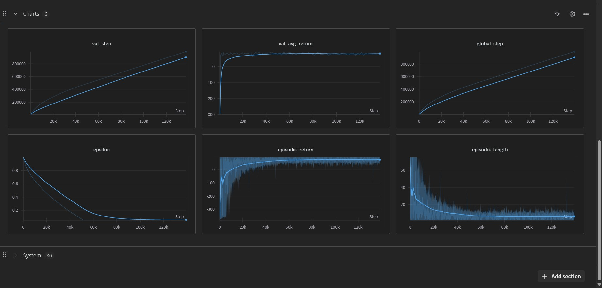

## VizDoom Reinforcement Learning (DQN)

<p align="center">
  
</p>

### Overview
This module trains a Deep Q-Network (DQN) agent on the VizDoom Basic scenario using Gymnasium’s VizDoom wrapper. It includes robust image preprocessing, replay buffer training, WandB logging, and optional video recording for training and evaluation.

### Folder Structure
```
VizDoom-RL/
├── basic_initial.py       # DQN training + evaluation script
├── test.py                # (aux/testing script, if present)
├── _vizdoom.ini           # VizDoom configuration (optional/custom)
├── images/
│   └── vizdoomBasic.jpg   # Screenshot used in the docs
└── (generated at runtime)
    ├── videos/            # Evaluation and/or training videos
    └── runs/              # (If enabled) TB-like run artifacts
```

### Key Features
- DQN with target network and epsilon-greedy exploration
- Vectorized image preprocessing (channel-first, grayscale, resize to 128×128)
- Gymnasium VizDoom environment: `VizdoomBasic-v0`
- Replay Buffer from Stable-Baselines3 for efficient experience sampling
- Periodic evaluation with optional video export
- Optional WandB logging

### Algorithm Summary (DQN)
- Q-network and target network with 3 conv layers + 2 FC layers
- Epsilon decays linearly from `start_e` to `end_e` over `exploration_fraction * total_timesteps`
- TD target: `r + γ * max_a' Q_target(s', a')`
- Optimizer: Adam, MSE loss
- Target updates every `target_network_frequency` steps via polyak mix with `tau`

### Image Preprocessing
- Converts observations to float32
- Handles dict observations (uses `obs['screen']` when present)
- Converts RGB to grayscale, channel-first, resizes to 128×128
- Normalizes to [0, 1]

### Configuration (excerpt from `basic_initial.py`)
```python
class Config:
    exp_name = "DQN-VisDoom-Basic-v0"
    seed = 42
    env_id = "VizdoomBasic-v0"
    total_timesteps = 1_000_000
    learning_rate = 2e-4
    buffer_size = 30_000
    gamma = 0.99
    tau = 1.0
    target_network_frequency = 50
    batch_size = 128
    start_e = 1.0
    end_e = 0.05
    exploration_fraction = 0.5
    learning_starts = 1_000
    train_frequency = 4
    capture_video = True
    save_model = True
    upload_model = True
    use_wandb = True
    wandb_project = "cleanRL"
    eval_iter = 10_000
```

### Dependencies
Install the required packages (CUDA optional but recommended):
```bash
pip install torch gymnasium vizdoom opencv-python imageio albumentations stable-baselines3 tqdm wandb
```

Notes:
- The script imports `from vizdoom import gymnasium_wrapper`; make sure your `vizdoom` version provides the Gymnasium wrapper.
- If you run headless, ensure appropriate SDL/vizdoom settings (e.g., `SDL_VIDEODRIVER=dummy`).

### Quick Start
Run training (from the repository root or the `VizDoom-RL/` directory):
```bash
python VizDoom-RL/basic_initial.py
```
This will:
- Initialize WandB if enabled
- Create `videos/<run_name>/{train,eval}` and `runs/<run_name>` folders
- Train for `total_timesteps`, evaluate every `eval_iter` steps

### Evaluation and Videos
- The script periodically evaluates the model and can record frames.
- At the end, it saves a final evaluation video to:
```text
VizDoom-RL/images/final.mp4
```
- You can adjust recording cadence or disable/enable in the script (`capture_video`, `eval_iter`).

### Tips and Troubleshooting
- If you see dtype errors during preprocessing, confirm frames are converted to `float32` before normalization.
- If action space detection fails, the script falls back to a sensible default (3).
- For slower training, reduce `total_timesteps` or `batch_size`; for faster, ensure GPU is used.
- To disable WandB: set `use_wandb = False` in `Config`.

### Extending
- Swap `env_id` to other VizDoom scenarios supported by the wrapper.
- Adjust the CNN or add dueling/Double-DQN.
- Introduce prioritized replay or multi-step targets.

### References
- VizDoom: https://vizdoom.cs.put.edu.pl/
- Gymnasium: https://gymnasium.farama.org/
- Stable-Baselines3: https://stable-baselines3.readthedocs.io/
- WandB: https://wandb.ai/
